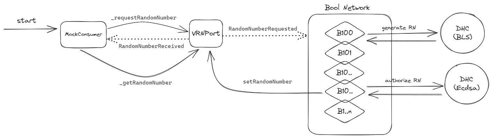

    

# Bool Network Verifiable Random Number (VRN)

## Overview

Bool Network VRN module is a decentralized random number generation service that based on Dynamic Hidden Committees (DHC) to perform as a secure and verifiable source of randomness for smart contracts.

(<a href="#readme-top">back to top</a>)

## Project Structure

- `/contracts`: main VRN smart contracts and mock VRN consumer contracts.
- `/tests`: tests for the VRN smart contracts.
- `/docs`: guides for **Quick Start**.

(<a href="#readme-top">back to top</a>)

## System Design

This section provides an overview of the Bool Network's Verifiable Random Number (VRN) module.

### Key components

The following components play crucial roles in the operation of the VRNPort contract and the generation of random numbers within the BOOL Network ecosystem:

- **VRNPort:** Responsible for random number generation, `VRNPort` interfaces with the Dynamic Hidden Committee (DHC) service. It initiates randomness requests, triggers corresponding events, and validates the received random numbers and credentials from the DHC service.

- **BOOL Network:** Serving as both a blockchain and a monitoring and validating system, Bool Network records DHC information. It facilitates the forwarding of requests from VRNPort on multiple external networks and ensures the submission of request results back to the respective network.

- **DHC Service:** The Dynamic Hidden Committee (DHC) service plays a critical role in generating random numbers. It identifies requests by monitoring events emitted by Bool Network and calculates random numbers based on request IDs. The DHC service subsequently submits the generated random numbers, along with their generation methods, as proofs to Bool Network.

These components collectively contribute to the secure and verifiable generation of random numbers within the Bool Network ecosystem.

(<a href="#readme-top">back to top</a>)

### Complete cycle

[Figure 1.](#fig:bool-vrn) depicts the complete cycle of a VRN request, from the initial request to the final consumption of the random number. The cycle consists of four steps in chronological order:

- A requester contract, e.g. `MockConsumer`, requests a random number (on-chain).
- The `Dynamic Hidden Committee` (DHC) service generates a random number with the corresponding signature (off-chain).
- The Deliverer service submits the random number to `VRNPort` contract (on-chain).
- The corresponding requester fetches and utilizes the random number (on-chain).

    
    
<strong>Figure 1. </strong>The complete cycle of VRN.

(<a href="#readme-top">back to top</a>)

## Quick Start

Please refer to the [Quick Start](docs/guide.md) guide for more information.

## Deployment Addresses

Deployment addresses for the `VRNPort` contract on various networks.

### Testnets

- Linea Goerli: [0x6a65aFBCEe96393a0A7d6eeEaE8002774ac99ED7](https://goerli.lineascan.build/address/0x6a65aFBCEe96393a0A7d6eeEaE8002774ac99ED7)
- Scroll Sepolia: [0x0A756e7C9De7b50FE6370E53A3fBcB987D4163f8](https://sepolia-blockscout.scroll.io/address/0x0A756e7C9De7b50FE6370E53A3fBcB987D4163f8)

(<a href="#readme-top">back to top</a>)

## Official Links
- [Website](https://bool.network/)
- [Documentation](https://boolnetwork.gitbook.io/docs/)
- [GitHub](https://github.com/boolnetwork)
- [Twitter](https://twitter.com/Bool_Official)

(<a href="#readme-top">back to top</a>)
