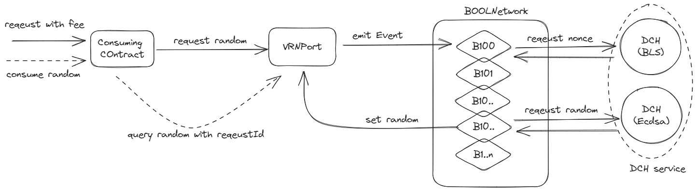

# Introduction

This guide elucidates the process of generating random numbers through BOOLNetwork's VRN, involving interactions such as users paying fees to request random numbers and users proactively invoking calls to consume these random values.

## Requesting and Consuming Random Numbers

A complete cycle for requesting and consuming random numbers is as depicted below:

`VRNPort`: is the contract responsible for random number generation. It interacts with the [DHC](https://docs.bool.network/docs/concepts/dynamic-hidden-committee-dhc) service. When a request for randomness is initiated, it triggers an event and subsequently validates the random number and credentials submitted by the DHC service.

`BOOLNetwork`: serves as a blockchain and monitoring system. It records information of DHC, forwarding requests from `VRNPort` on various sub-chains while also submitting the request results back to the respective sub-chains.

`DHC service`: The DHC service identifies requests by monitoring events emitted by BOOLNetwork and calculates random numbers based on request IDs. The DHC service then submits the proof, which includes the random number and its generation method, to BOOLNetwork.

## Configuring Your Contract

Configure your contract as follows:

1. Your contract must inherit from `BoolVRNConsumerBase`.
2. Submit random number requests by calling the `_requestRandomNumber` function within the `BoolVRNConsumerBase` contract. Include the following parameters in your request:
    - `fee`: Indicates the fee required for the current request. You can call 'getVRNPortFee' function to the value.
  
## Consuming Your Request

Once a request is submitted, you must wait for the random number to be generated and then actively consume it:

1. `BOOLNetwork` will submit the generated random number and credentials to `VRNPort`.
2. `VRNPort` will trigger the event `RandomNumberReceived(uint256 requestId, address indexed requester)`.
3. Users listen to events in the consumer contract associated with a specific `requestId`, can filter events based on the `requester`.
4. Users call the consumer contract to retrieve the random number for the given `requestId` from `VRNPort` and proceed with subsequent logic.

## Example

### Requirements

This guide assumes that you are familiar with how to create and deploy smart contracts on EVM-compatible chains using the following tools:

[The Remix IDE](https://remix.ethereum.org/)
[MetaMask](https://metamask.io/)

### Creating and Deploying a Contract

This tutorial utilizes the `MockVRNConsumer` contract as an example. The contract relies on `BoolVRNConsumerBase.sol` and `IVRNProt.sol`. To deploy the `MockVRNConsumer` contract, you need to provide the contract address for `VRNPort`, which is deployed on different chains by the official team.

Compile and deploy the contract on Linea testnet.

1. Open the `MockVRNConsumer` contract in Remix.
2. Click the `Compile` button to compile the `MockVRNConsumer` contract.
3. On the deployment page, select the `MockVRNConsumer` contract from the contract list, click `Deploy`, and confirm the transaction in MetaMask.
4. After deploying the contract, you can find the `MockVRNConsumer` contract in the deployment list.

### Requesting a Random Number

The deployed contract requests a random number from `VRNPort`. Initiate the request by executing the `startPuzzle` function. This transaction requires a fee, which can be obtained by calling the `getVRNPortFee` function.

1. In the list of deployed contracts, select the `MockVRNConsumer` contract, and click on the `getVRNPortFee` function to query the fee, denoted as X, for a single random number request.
2. Input the value X in the `VALUE` field of the transaction, click the `startPuzzle` function, and the contract will request a random number from `VRNPort`. Confirm the transaction in MetaMask.

### Consuming the Random Number

After the request is sent, wait for the random number to be generated. Once the random number associated with a specific `requestId` is available, trigger a transaction to consume it.

1. To obtain the `requestId`, call the `lastRequestId()` function.
2. The status and the random number associated with the `requestId` will be updated by the system once the random number is submitted.
3. Call the `getPuzzleResult` function while specifying the `requestId`.

